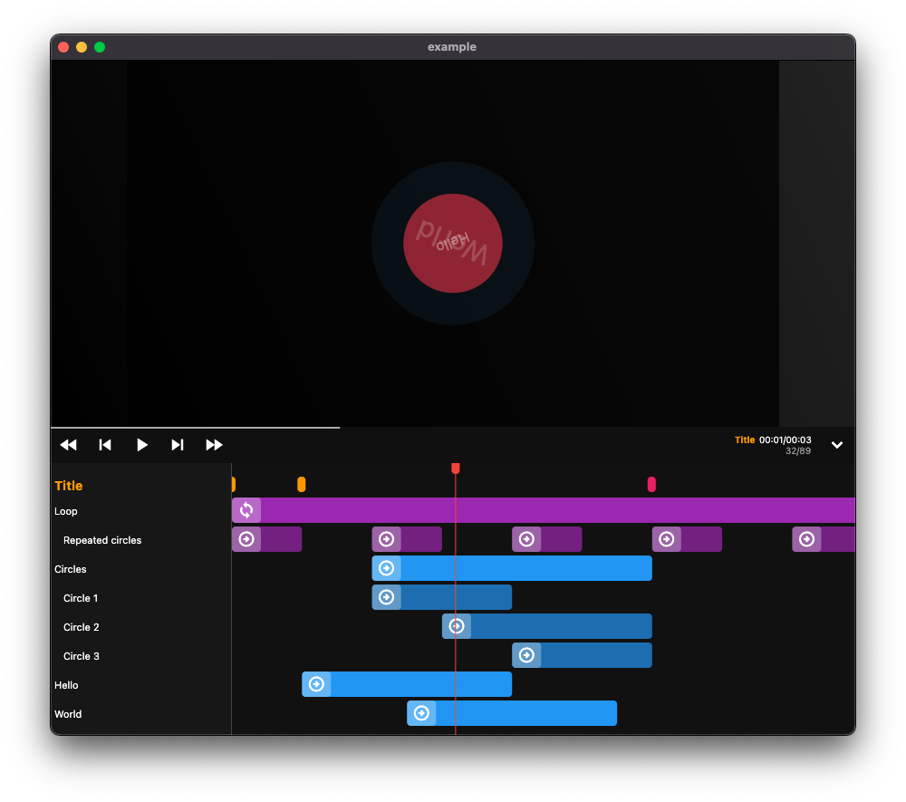

Use your Flutter knowledge to generate videos, animations and slideshows!

Automate your video production with server-side rendering.



> Footage is still in early stage! Use it at your own risks, and API are subject to change.

## Quickstart

Install `footage` with pub.

```
dart pub global activate footage
```

Create a directory for your project, like `my_video`, and from this directory, run the footage `init` command.

```bash
mkdir my_video
cd my_video
footage init
```

This will initialize a flutter project, with footage default pre-configured template.

To start the preview mode, simply run the `lib/main.dart` like any regular Flutter app.

```bash
flutter run lib/main.dart -d macOS
```

## Code your animations

### Composition

The composition root object describes your video general properties.

```dart
Composition(
    fps: 30,
    duration: const Time.frames(90),
    width: 1920,
    height: 1080,
    child: const MyScene(),
);
```

### Current frame and configuration

Any `Composition` descendant can then access the current frame and video properties through the `context.video` extension.

```dart
@override
Widget build(BuildContext context) {
    final frame = context.video.currentFrame;
    final fps = context.video.config.fps;
    final videoWidth = context.video.config.width;
    // ...
}
```

### Sequence

Sequences are small sections in finite time that make up your video clip. By using a sequence, you can time-shift the animations of your children.

```dart
Sequence(
    name: 'Circle', // For preview editor
    from: Time.frames(10),
    duration: Time.frames(20),
    child: Builder(
        builder: (context) {
            final frame = context.video.frame; // From 0 to 20 (since sequence starts at 10 and ends at 30)
            // ...
        },
    ),
);
```

### Loop

Repeats all children animations during the given duration.

```dart
Loop(
    name: 'Repeated circles', // For preview editor
    duration: Time.frames(20),
    child: Builder(
        builder: (context) {
            final frame = context.video.frame; // From 0 to 20, every 20 frames
            // ...
        },
    ),
);
```

## Render your video

### As png frames

Form your project directory, run the 

```bash
footage render
```

You will find the output frame images in your `build/video/frames`.

> Under the hood, the rendering process uses `flutter_test` to render each frame as an individual image, thanks to golden tests. This allows rendering without the need to run the app.

### As a video

> To render a video you first need to install [ffmpeg](https://ffmpeg.org/) command line tool.

#### Basic

Bring a `-f` format option to the `render` command.

They are simply shorcuts for `ffmpeg` commands :

* `webm` : `ffmpeg -i build/video/frames/%d.png -pix_fmt yuva420p -filter:v fps=<fps> build/video/out.webm`

```bash
footage render -f webm
```

The resulting video is `build/video/out.webm`.


#### Advanced

Use the `ffmpeg` tool from your frame files.

```bash
footage render
ffmpeg -i build/video/frames/%d.png -pix_fmt yuva420p -filter:v fps=30 build/video/out.webm
```

## Roadmap

- [ ] Asset management when rendering
- [ ] Asynchronous frame rendering
- [ ] More default ffmpeg video rendering options
- [ ] Embeddable player for Flutter apps
- [ ] Slideshow preview mode for presentation
- [ ] More examples
- [ ] Website

## Thanks 

Massive thanks to the [Remotion](https://www.remotion.dev/) project which inspired me a lot of concepts. 